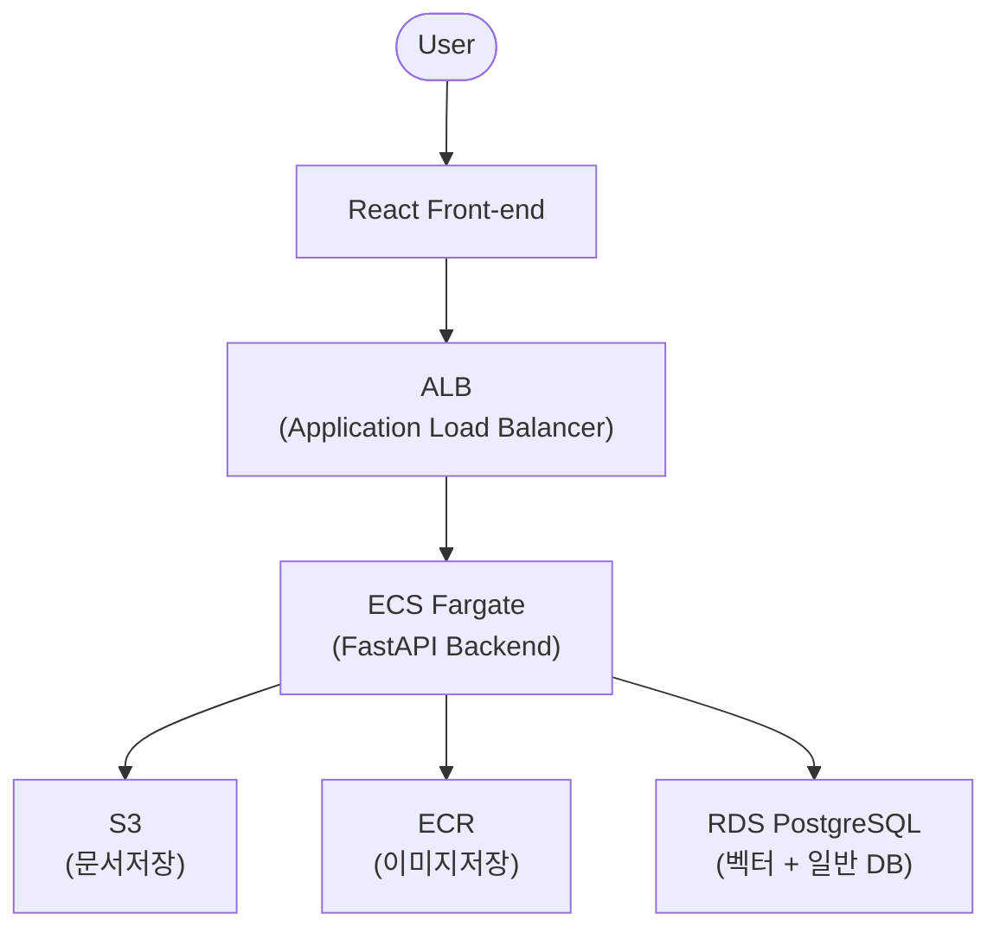

> # 2025 캡스톤 디자인 
> ## Team 멋진러닝
<table>
<thead>
<tr>
<th align="center"><strong>이수</strong></th>
<th align="center"><strong>이호련</strong></th>
<th align="center"><strong>박태승</strong></th>
</tr>
</thead>
<tbody>
<tr>
<td align="center"><a href="https://github.com/2siuuuu"> <br> @2siuuuu</a></td>
<td align="center"><a href="https://github.com/HoRyun"> <br> @HoRyun</a></td>
<td align="center"><a href="https://github.com/dpuw316"> <br> @dpuw316</a></td>

</tr>
<tr>
<td align="center"><strong>Backend</strong></td>
<td align="center"><strong>Cloud & CI/CD PipeLine</strong></td>
<td align="center"><strong>Frontend</strong></td>

</tr>
</tbody>
</table>

</br>

# 프로젝트 이름: RAG 기반 AI 지능형 문서 관리 시스템

</br>
Retrieval-Augmented Generation(RAG) 기술을 활용한 문서 검색 및 질의응답 시스템입니다. 사용자는 문서를 업로드하고 챗봇에게 해당 문서에 관련된 질문을 할 수 있습니다.
또한 자연어 명령으로 파일 관리 작업을 할 수 있습니다.

</br>

# 주요 기능

</br>

|  기능 구분  |  기능 명  |
|  -------  |  ----------  |
|유저|회원가입|
||로그인|
|문서|문서 업로드|
||문서 다운로드|
||요약|
||검색|
||기타 파일 관리 작업(폴더 생성, 복사, 잘라내기, 삭제, 이름 변경)|

</br>

# 기술 스택

### **백엔드**

- **FastAPI**
- **LangChain**
- **PostgreSQL (AWS RDS)**
- **Redis** 

### **프론트엔드**

- **React**: 사용자 인터페이스 구현


### **인프라/클라우드**

- **AWS S3**: 문서 파일 저장소
- **AWS ECR**: 컨테이너 이미지 저장소
- **AWS ECS Fargate**: 서버리스 백엔드 컨테이너 오케스트레이션
- **AWS RDS**: 관리형 PostgreSQL 데이터베이스
- **Docker**: 애플리케이션 컨테이너화 및 환경 통일

</br>

# 아키텍처



- **문서 저장**: 업로드 문서는 AWS S3에 저장
- **컨테이너 관리**: 백엔드는 Docker 이미지로 빌드, ECR에 저장, ECS Fargate에서 실행
- **DB 관리**: 벡터 검색 및 RAG 데이터는 AWS RDS PostgreSQL에서 관리


</br>

# 설치 및 실행 방법

<이 항목에서 환경 변수 설정 방법도 안내>

### 1. 사전 요구사항


- [Docker Desktop](https://www.docker.com/products/docker-desktop/) 설치
- AWS CLI 및 필요한 자격증명(로컬 테스트 시)

**OR**

< 모든 기능을 컨테이너로 실행하는 방법에 대한 사전 요구사항 기재 >

### 2. 설치 및 실행

```bash
# 저장소 복제
git clone https://github.com/HoRyun/rag-document-search.git
cd rag-document-search

# 애플리케이션 빌드 및 실행
docker-compose up --build
```

**OR**

< 모든 기능을 컨테이너로 실행하는 방법에 대한 설치 및 실행 방법 기재 >


</br>

# API 문서
컨테이너 실행 후:

```
http://localhost:8000/docs
```
OR
```
http://localhost:8000/redoc
```


</br>

# 환경 변수

contents

---
---
---

# README 수정 전

[](https://github.com/HoRyun/rag-document-search/actions/workflows/frontend-ci-cd.yml)

# RAG Document Search

Retrieval-Augmented Generation(RAG) 기술을 활용한 문서 검색 및 질의응답 시스템입니다. 사용자는 문서를 업로드하고 해당 문서에 관련된 질문을 할 수 있습니다. 

---

## 주요 기능 
- **문서 관리**: 문서 업로드, 조회, 삭제
- **텍스트 처리**: 문서에서 텍스트 추출 및 벡터화
- **질의응답**: 자연어 질문에 대한 정확한 응답 생성 
- **사용자 친화적 UI**: 직관적인 인터페이스 제공

---

## 기술 스택


### 백엔드

- **FastAPI**
- **LangChain**
- **PostgreSQL (AWS RDS)**
- **Redis** 

### 프론트엔드

- **React**: 사용자 인터페이스 구현


### 인프라/클라우드

- **AWS S3**: 문서 파일 저장소
- **AWS ECR**: 컨테이너 이미지 저장소
- **AWS ECS Fargate**: 서버리스 백엔드 컨테이너 오케스트레이션
- **AWS RDS**: 관리형 PostgreSQL 데이터베이스
- **Docker**: 애플리케이션 컨테이너화 및 환경 통일

---

## 아키텍처

```
[User]
   |
[React Front-end]
   |
[ALB (Application Load Balancer)]
   |
[ECS Fargate (FastAPI Backend)]
   |           |             |
[S3]       [ECR]         [RDS PostgreSQL]
(문서저장) (이미지저장)    (벡터+일반DB)
```

- **문서 저장**: 업로드 문서는 AWS S3에 저장
- **컨테이너 관리**: 백엔드는 Docker 이미지로 빌드, ECR에 저장, ECS Fargate에서 실행
- **DB 관리**: 벡터 검색 및 RAG 데이터는 AWS RDS PostgreSQL에서 관리

---

## 설치 및 실행

### 1. 사전 요구사항

- [Docker Desktop](https://www.docker.com/products/docker-desktop/) 설치
- AWS CLI 및 필요한 자격증명(로컬 테스트 시)


### 2. 설치 및 실행

```bash
# 저장소 복제
git clone https://github.com/HoRyun/rag-document-search.git
cd rag-document-search

# 애플리케이션 빌드 및 실행
docker-compose up --build
```


---

## CI/CD 및 배포

- **GitHub Actions**를 통한 자동화된 CI/CD 파이프라인 구축
- `main`, `develop-backend`, `develop-cloud` 브랜치 등에서 푸시 시
    - 테스트 → Docker 이미지 빌드 → ECR 푸시 → ECS Fargate 무중단 배포
- 워크플로 파일은 `.github/workflows/`에 위치

---

## 환경 변수 및 시크릿 관리

- 민감정보(API Key 등)는 코드에 직접 포함하지 않고,
AWS Secrets Manager, GitHub Secrets 또는 환경변수로 안전하게 관리

---
 
## 참고

- [GitHub Actions 공식 문서](https://docs.github.com/actions)
- [AWS ECS 공식 문서](https://docs.aws.amazon.com/ko_kr/AmazonECS/latest/developerguide/Welcome.html)

---
